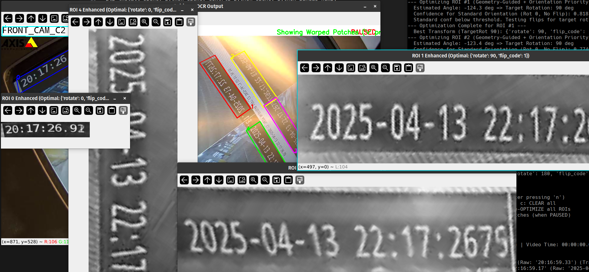

# What is this?
This is a small tool for extracting text from pre-defined regions in video files.
The specific case this has been tuned for is looking for timestamps in some special video files.
The user must define the regions to examine in the video. It is assumed that the camera is standing still, and the text changes per frame.
This tool does some transformations on the regions and image data, then uses Paddle OCR to extract the text.

Make sure you understand the dependencies, their size and other requirements before attempting to use this. It is a small script, but it has some rather large and heavy dependencies.

Not tested on Windows, only Linux (PopOS/Ubuntu 22.04)

# About
- Author: Audun Føyen
- Email: audun@audunfoyen.com
- Copyright (c) 2025 Audun Føyen
- License: MIT

With help from various LLMs.

# System
- Tested on PopOS (essentially Ubuntu):
- Description:	Pop!_OS 22.04 LTS

# Install
The requirements are relatively heavy. Make sure you have enough disk space and time for the download from Tsinghua University in China (it's slow).
```
sudo apt update && sudo apt install -y libgl1-mesa-glx
sudo apt install libgtk2.0-dev pkg-config
pip uninstall opencv-python-headless opencv-contrib-python-headless
pip install opencv-python opencv-contrib-python opencv-python pandas numpy
pip install paddlepaddle-gpu paddleocr -i https://pypi.tuna.tsinghua.edu.cn/simple
```

# Control
Stuff to do when the program is running (keyboard commands.)
```
 Mouse Click: Define ROI corners (after pressing 'n')
  n: Start NEW ROI | d: DELETE last | c: CLEAR all
  s: SAVE ROIs | l: LOAD ROIs | o: Re-OPTIMIZE all ROIs
  v: Toggle VIEW warped/optimized patches (when PAUSED)
  SPACE: PAUSE / RESUME | q: QUIT
```

# How to use
```
Usage: python your_script_name.py <path_to_video.avi> [output_csv_file] [sample_interval_sec]

Arguments:
  <path_to_video.avi>: Path to input video (required).
  [output_csv_file]:   Optional. Path for output CSV. Defaults to 'roi_ocr_results.csv'.
  [sample_interval_sec]: Optional. Seconds between OCR attempts. Defaults to 1.0.

Requires: paddleocr, paddlepaddle-gpu (or paddlepaddle), opencv-python, pandas, numpy

Example:
  python your_script_name.py movie.avi roi_results.csv 0.5
```

# Run
```python3 extract_timestamps.py sq47868.avi results.csv 1```

This will analyze the AVI file, dump results in results.csv, and take a sample every second of the video.

When first started, the user must point out where the text is located. This is called defining "regions of interest" (ROIs).
Without these regions, the program won't do anything.

Steps:
- ```python3 extract_timestamps.py sq47868.avi results.csv 1```
- Press SPACE in order to halt the video
- Press ```n``` to define a new ROI
- Use the mouse and press all four corners of the Region Of Interest (the text to capture). Press first corner, second corner, etc. It'll draw a box around those.
- Repeat, until all interesting regions have been captured
- Press ```o``` to optimize all ROIs (this means running them through different transformations to see which gives the best result)
- (optional) Press ```v``` to view all the defined ROIs and how they have been transformed
- Press ```s``` to save the ROIs to ```roi_config.json```
- Press SPACE again to resume decoding
- Let the video run until the end and look at all the results.

# Screenshot
Colored rectangles are ROIs. Images with large timestamps in black and white are  these regions after pre-processing - prior to OCR.
